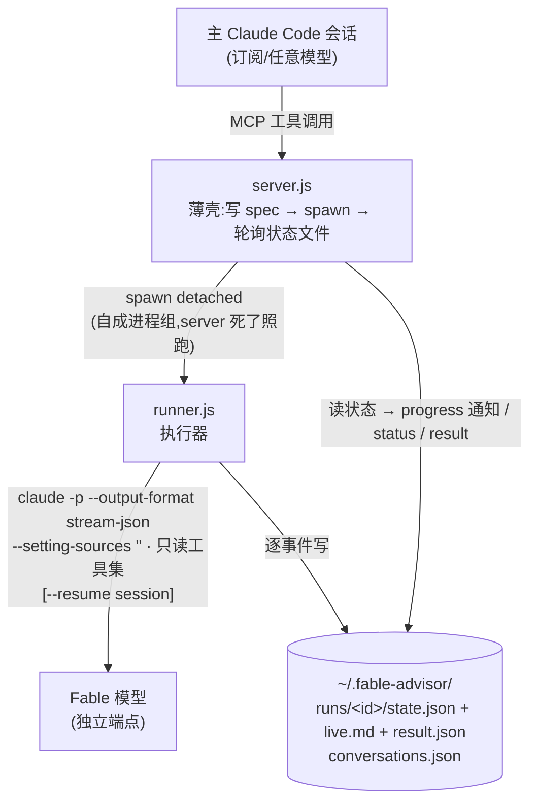

<div align="center">

# 🧙 Fable Advisor

**把一个独立端点上的强力模型(Fable)变成 Claude Code 里随叫随到的代码顾问**

代码审查 · 安全审计 · 技术辩论 · 实验结果分析

[](https://nodejs.org)
[](https://modelcontextprotocol.io)
[](#-开发与测试)
[](https://code.claude.com)

主会话该用什么模型用什么模型;需要第二意见时,一句话召唤 Fable。<br>
它**自己读你的代码**(严格只读),想多深聊多深(命名对话持久续聊),<br>
跑多久都行(实时进度 + 后台运行,无硬超时)。

</div>

---

## 📑 目录

- [特性一览](#-特性一览)
- [工作原理](#-工作原理)
- [安装教程](#-安装教程)
  - [前置要求](#0-前置要求)
  - [获取代码](#1-获取代码)
  - [注册为 MCP server](#2-注册为-mcp-server)
  - [验证安装](#3-验证安装)
  - [升级与卸载](#4-升级与卸载)
  - [特殊网络环境(代理/wrapper)](#5-特殊网络环境代理wrapper)
- [五个工具](#-五个工具)
- [四种模式](#-四种模式)
- [命名对话:持久续聊](#-命名对话持久续聊)
- [实时进度与后台运行](#-实时进度与后台运行)
- [环境变量](#-环境变量)
- [使用示例](#-使用示例)
- [故障排查](#-故障排查)
- [开发与测试](#-开发与测试)

---

## ✨ 特性一览

| | |
|---|---|
| 🔍 **自主探索** | Fable 用只读工具(Read/Grep/Glob)+ 联网(WebFetch/WebSearch)自己看代码,prompt 只需说"看什么、为什么" |
| 🧵 **命名对话** | 同名 `conversation` 续聊,Fable 记得之前的所有内容;跨会话持久,续聊还省钱(缓存命中) |
| 📡 **实时进度** | 阻塞等待时状态行滚动显示 `step 3 · Read src/train.py · 1.8k tok · 52s`,不再黑盒干等 |
| 🌙 **后台运行** | `background=true` 立即返回,`tail -f` 看全文直播;MCP server 重启、主会话关掉,任务照跑 |
| ⏳ **无硬超时** | 只看活性:任务再大,只要还在动就不杀;真挂死了才判失败 |
| 🔁 **自动重试** | 429/限流自动退避重试;上游 session 失效自动降级新开 |
| 🔒 **严格隔离** | 子进程不读你的 `settings.json`、不跑你的 hooks、不能写任何文件;凭据只存在 MCP 注册的 env 里 |

## 🔭 工作原理



所有状态都在磁盘:server、主会话随便重启,在跑的任务不受影响,跨会话可查可续。

---

## 📦 安装教程

### 0. 前置要求

| 依赖 | 要求 | 检查命令 |
|---|---|---|
| Node.js | ≥ 22 | `node --version` |
| Claude Code CLI | 任意近期版本 | `claude --version` |
| 模型端点 | 一个 Anthropic 兼容的 API 端点 + token(官方 API 或中转均可) | — |

> [!NOTE]
> 这套工具的典型场景:主会话用 Claude 订阅,Fable 走**另一个**端点(比如某个中转)。
> 两套凭据完全隔离,互不影响。

### 1. 获取代码

**方式 A:git clone(联网机器)**

```bash
git clone https://github.com/mingxuZhang2/Fable-Advisor.git ~/fable-advisor
cd ~/fable-advisor
npm install
npm test          # 应看到 29 个测试全绿,不需要任何凭据
```

**方式 B:整目录拷贝(服务器装不了 npm 时)**

在任意联网机器上 clone + `npm install` 后,把整个目录(**连 `node_modules` 一起**)打包传过去,
服务器上一行安装命令都不用跑:

```bash
tar czf /tmp/fable-advisor.tgz --exclude='.git' fable-advisor
scp /tmp/fable-advisor.tgz your-server:/tmp/
ssh your-server 'tar xzf /tmp/fable-advisor.tgz -C ~'
```

> 依赖是纯 JS(MCP SDK + zod),没有原生模块,跨 macOS/Linux 拷贝没有兼容性问题。

### 2. 注册为 MCP server

```bash
claude mcp add -s user fable-advisor \
  -e FABLE_BASE_URL=https://your-relay.example.com \
  -e FABLE_AUTH_TOKEN=sk-xxxxxxxxxxxxxxxx \
  -e FABLE_CLAUDE_BIN=/绝对路径/到/真实的/claude \
  -- node /绝对路径/到/fable-advisor/server.js
```

逐项说明:

| 项 | 说明 |
|---|---|
| `-s user` | 注册到用户级配置(`~/.claude.json`),**所有项目可用**;想只在某个项目用就改 `-s project` |
| `FABLE_BASE_URL` | Fable 所在端点的地址 |
| `FABLE_AUTH_TOKEN` | 该端点的 token。**只**存在 MCP 注册配置里,advisor 子进程通过环境变量继承,不落任何其他文件 |
| `FABLE_CLAUDE_BIN` | 可选。`claude` 不在 PATH、或 PATH 上的 `claude` 是个 wrapper 脚本时,指向**真实二进制**的绝对路径 |
| `node /…/server.js` | 都用绝对路径,避免 cwd 问题 |

> [!IMPORTANT]
> 注册只会往 `~/.claude.json` **追加**一个条目,不碰你现有的任何配置。
> 后悔一条命令撤销:`claude mcp remove -s user fable-advisor`。

### 3. 验证安装

```bash
claude mcp list        # 应显示 fable-advisor ✓ connected
```

然后开一个 claude 会话,跑一次全链路测试:

> 用 consult_fable 工具,prompt 写 "Reply with exactly: CHAIN-OK",directory 用当前目录的绝对路径

返回 `CHAIN-OK` 即全链路(MCP → runner → 端点 → Fable)畅通。✅

### 4. 升级与卸载

```bash
# 升级:覆盖目录即可(注册命令、env、路径全不变,drop-in)
cd ~/fable-advisor && git pull && npm install
# 然后在 claude 会话里 /mcp → reconnect,或重开会话

# 卸载
claude mcp remove -s user fable-advisor
rm -rf ~/fable-advisor ~/.fable-advisor
```

### 5. 特殊网络环境(代理/wrapper)

如果你的 `claude` 是个先起代理再启动真身的 wrapper 脚本(常见于需要代理访问 API 的服务器):

- **`FABLE_CLAUDE_BIN` 一定要指向真实二进制**,不要指向 wrapper——否则每次咨询都会
  重复起一个代理实例,而且 wrapper 的输出会污染 JSON 解析;
- 不用担心代理:advisor 子进程**自动继承**主会话里 wrapper 导出的
  `HTTPS_PROXY` 等环境变量,流量照样走你已经在跑的代理;
- 代价是:主会话必须经 wrapper 启动(你本来就是这么用的)。

---

## 🧰 五个工具

| 工具 | 作用 |
|---|---|
| `consult_fable` | 主入口:发起一次咨询(阻塞或后台) |
| `fable_status` | 查 run 进度:状态、当前动作、耗时、最近输出(默认最近一个 run) |
| `fable_result` | 取最终回答(+成本/耗时/对话元信息);没跑完则返回当前进度 |
| `fable_conversations` | 列出/删除命名对话(按项目目录) |
| `fable_cancel` | 取消在跑的 run(杀整个进程组,live.md 保留部分转录) |

<details>
<summary><b>consult_fable 参数表</b>(点开)</summary>

| 参数 | 类型/默认 | 说明 |
|---|---|---|
| `prompt` | string,必填 | 咨询/审查/讨论内容(自包含,Fable 自己读代码) |
| `directory` | string,必填 | 项目绝对路径(子进程 cwd,Fable 的可读范围) |
| `mode` | 枚举,默认 `discuss` | 见[四种模式](#-四种模式) |
| `conversation` | string,默认 `"default"` | 命名对话,同名续聊(底层 `--resume`) |
| `fresh` | bool,默认 `false` | 丢弃该名字的历史,重新开始 |
| `files` | string[],可选 | 重点文件/子目录(相对 directory) |
| `background` | bool,默认 `false` | `true`:立即返回 run_id,不阻塞 |

</details>

## 🎭 四种模式

| mode | 角色 | 适合 |
|---|---|---|
| `review` | 代码审查:实现正确性——bug、边界条件、逻辑错误;Critical/Important/Minor 严格定义(科研代码按"会不会改变论文结论"分级),不凑数、不报风格问题,带 finding 范例 | 改完一个 feature/修完一个 bug 之后 |
| `audit` | 对抗审计:安全/数据正确性/质量清单式排查,宽撒网但每条带 [Confirmed\|Likely\|Speculative] 分诊标签 | 上线前、处理敏感数据的代码 |
| `discuss` | **默认模式**·辩论伙伴/第二意见/架构与设计讨论:开头必须亮立场,不附和;帮你拿主意时给明确推荐 | 技术选型、架构讨论、"我该怎么做"、想找人抬杠 |
| `research` | **科研协作者(PI 视角)**:解读实验结果(机制解释,非复述)、排查实验 setting 的效度威胁、按信息增益排序下一步 | 实验结果出来后:"这说明什么?下一步怎么走?够不够投稿?" |

公共纪律(所有模式):回复语言跟随提问;引用必须 `file:line`;论断必须基于真读过的代码,没验证的标 "unverified";说不出触发场景就不报(空 findings 合法,高危低置信例外);单条 finding 一段以内;findings 在前、综述在后;不夸大严重度;最终消息自包含、以结论收尾。

**所有模式都可以自派只读 subagents 并行探索大 repo**(prompt 已要求:subagent 的报告只算线索,必须亲自对照代码核实、去重后才能写进结论)。

> [!TIP]
> 派 subagents 的大任务(整库 review/audit、research)单次成本比普通调用高几倍($1-3 量级),建议配合 `background=true` 使用。

## 🧵 命名对话:持久续聊

```text
你:  用 consult_fable,conversation 叫 "rl-design",mode=discuss,
     问 Fable:reward shaping 这样设计合理吗?
…(Fable 给出观点)
你:  在 rl-design 里继续:它说的第 2 点我不同意,因为 ……
…(Fable 记得自己说过什么,接着辩)
```

- 同名 `conversation` 再次调用 → Fable **记得之前聊过的全部内容**,且续聊因缓存命中显著便宜;
- `fresh=true` → 同名重开;换个名字 → 平行新线程(review 和辩论互不串味);
- `fable_conversations` 列出所有线程(名字、mode、轮数、最后使用、话题摘要);
- 注册表存在 `~/.fable-advisor/conversations.json`,按项目目录隔离,**跨主会话持久**——今天的辩论明天接着打。

## 📡 实时进度与后台运行

**阻塞模式**(默认):等待期间状态行实时滚动(MCP progress notification):

```text
⠸ consult_fable … step 3 · Read src/train.py · 1.8k tok · 52s
```

按 <kbd>Esc</kbd> 中断等待后 **run 继续在后台跑**,随后用 `fable_status` / `fable_result` 取。

**后台模式**(`background=true`):立即返回 `run_id`,然后:

```bash
tail -f ~/.fable-advisor/runs/<run_id>/live.md   # 全文直播:Fable 的每个动作 + 完整回答
```

进度问主模型("Fable 到哪步了" → `fable_status`),完事取结果(`fable_result`)。
整库 audit 这类大任务建议后台跑。

## 📄 报告落盘

每次咨询成功后,完整报告自动存一份 Markdown 到**被咨询项目**的 `fable-reports/` 目录:

```
<directory>/fable-reports/<run_id>-<conversation>.md   # meta + prompt + 完整报告
```

结果的 meta 行里会带 `report saved: <路径>`。不想入库就在项目 `.gitignore` 加一行 `fable-reports/`。

## ⚙️ 环境变量

| 变量 | 默认 | 说明 |
|---|---|---|
| `FABLE_BASE_URL` | **必填** | Fable 端点地址 |
| `FABLE_AUTH_TOKEN` | **必填** | 端点 token |
| `FABLE_MODEL` | `claude-fable-5[1m]` | 子进程用的模型 |
| `FABLE_EFFORT` | `xhigh` | 推理努力程度(low/medium/high/xhigh/max),固定值,不暴露给调用方 |
| `FABLE_CLAUDE_BIN` | `claude` | 真实 claude 二进制的绝对路径(PATH 上是 wrapper 时必设) |
| `FABLE_HOME` | `~/.fable-advisor` | 状态目录(runs/ + conversations.json) |
| `FABLE_STALL_MINUTES` | `10` | 活性看门狗:**没有硬超时**,连续 N 分钟无任何 stream 事件才判挂死 |
| `FABLE_HEARTBEAT_MS` | `10000` | 心跳间隔:上游静默(如限流内部重试)期间仍定期刷新状态,保证 progress 通知不断流 |
| `FABLE_RETRY_DELAYS_MS` | `5000,15000,30000` | 限流重试退避序列 |

## 💡 使用示例

在主 Claude Code 会话里说自然语言即可:

> 用 consult_fable 以 review 模式审一下我刚改的 src/runner.py,重点看边界条件

> 用 consult_fable 对整个项目做 background audit,把 tail 命令给我,我自己看直播

> 在 "rl-design" 这个 conversation 里继续和 Fable 辩论:它上次说的第二点我不同意,因为…

> 用 fable_conversations 列一下这个项目有哪些和 Fable 的对话

想让主模型主动用它?在项目 `CLAUDE.md` 加一句:

```markdown
- 完成较大的代码改动后,主动用 consult_fable(mode=review)请 Fable 审一遍,把结论汇总给我。
```

## 🔧 故障排查

<details>
<summary><b>阻塞调用约 1-2 分钟后被掐断 / run 莫名变成 cancelled</b></summary>

Claude Code 对 MCP 工具调用有自己的超时(env `MCP_TOOL_TIMEOUT`,毫秒),
靠 progress 通知喂着才不会掐。v2 的心跳机制(`FABLE_HEARTBEAT_MS`)保证即使上游
限流静默,通知也持续流出。如果你的端点经常长时间 429,可以在**启动 claude 的环境**里
调大超时(如 `MCP_TOOL_TIMEOUT=600000`),或干脆用 `background=true`。
另注:阻塞调用被掐断后 run 并没有死(继续后台跑),主模型有时会"好心"调 fable_cancel
把它取消掉——告诉它"不要 cancel,用 fable_status 等结果"即可。
</details>

<details>
<summary><b>429 / overloaded</b></summary>

runner 自动重试 3 次(5s/15s/30s 退避),状态行可见重试进度;仍失败说明端点限流严重,稍后再试。
</details>

<details>
<summary><b>stalled: no events for N min</b></summary>

活性看门狗判定挂死(连续 N 分钟无任何 stream 事件),杀进程组标 failed;
`live.md` 里已有的内容是部分结果。慢但还在动的任务**不会**被杀。
</details>

<details>
<summary><b>孤儿 run</b></summary>

state.json 超 60 秒没更新且 runner 进程已死 → `fable_status` 自动改判 failed。
</details>

<details>
<summary><b>resume 失效(上游清理了 session)</b></summary>

自动降级为新开对话继续跑,`live.md` 中注明,不会直接报错。
</details>

<details>
<summary><b>claude mcp list 显示连接失败</b></summary>

手动跑 `node ~/fable-advisor/server.js` 看报错——缺 env 时会直接打印
`FABLE_BASE_URL and FABLE_AUTH_TOKEN must be set`。
</details>

## 🧪 开发与测试

```bash
npm test    # 27 个测试:单元 + 端到端,全程用 tests/fake-claude.js 替身,不打真实 API
```

```text
fable-advisor/
├── server.js          # MCP stdio server(5 工具,薄壳:校验 → spawn → 轮询)
├── runner.js          # 执行器(detached;stream-json 解析、看门狗、重试、取消)
├── lib/
│   ├── store.js       # 文件状态机(原子写、对话注册表 + 锁、损坏自愈)
│   ├── modes.js       # 5 种模式的 system prompt 预设
│   └── events.js      # stream-json 事件 → 进度行/正文/终态(纯函数)
├── tests/             # node:test;fake-claude.js 可模拟限流/挂死/慢流/会话失效
└── docs/plans/        # 设计文档与实现计划
```

设计要点见 [docs/plans/2026-06-10-fable-advisor-v2-design.md](docs/plans/2026-06-10-fable-advisor-v2-design.md)。

---

<div align="center">

用 [Claude Code](https://claude.com/claude-code) 以 subagent-driven TDD 流程构建 🤖

</div>
